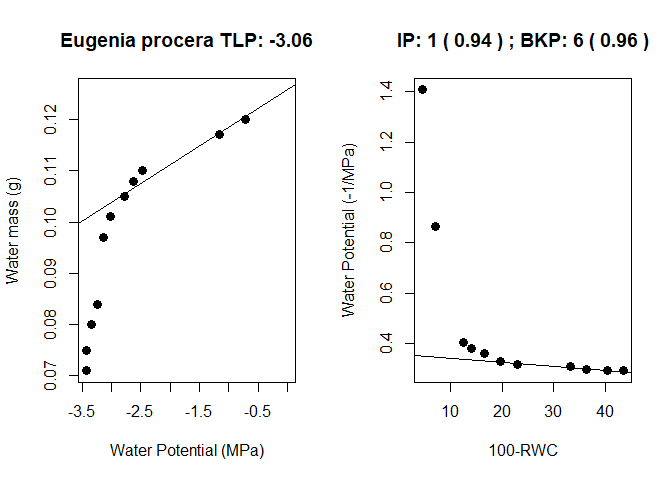

Pressure Volume Curves
================
German Vargas G.

Pressure volume curves:
-----------------------

These are measurements commonly done by plant ecophysiologists in order to obtain the turgor loss point (TLP, MPa) of leaves (a.k.a wilting point).

This is a tutorial on how to analyze pressure volume curves data. For more details on how to perform pressure volume curves using a pressure chamber see: <http://prometheuswiki.org/tiki-index.php?page=Leaf+pressure-volume+curve+parameters>.

The functions provided here are based on the method provided here:

-   Prometheus wiki: <http://prometheuswiki.org/tiki-index.php?page=Leaf+pressure-volume+curve+parameters>

-   Koide, R. T., Robichaux, R. H., Morse, S. R., & Smith, C. M. (1989). Plant water status, hydraulic resistance and capacitance. In *Plant physiological ecology* (pp. 161-183). Springer, Dordrecht. <https://link.springer.com/chapter/10.1007/978-94-009-2221-1_9>

-   Sack, L., Cowan, P. D., Jaikumar, N., & Holbrook, N. M. (2003). The ‘hydrology’of leaves: co‐ordination of structure and function in temperate woody species. *Plant, Cell & Environment*, 26(8), 1343-1356. <https://onlinelibrary.wiley.com/doi/full/10.1046/j.0016-8025.2003.01058.x>

-   Tyree, M. T., & Hammel, H. T. (1972). The measurement of the turgor pressure and the water relations of plants by the pressure-bomb technique. Journal of Experimental Botany, 23(1), 267-282.<https://academic.oup.com/jxb/article-abstract/23/1/267/623193>

Load the functions
------------------

``` r
source(file = "scripts/functions/water_mass.R")#directory to the scrpt files containing the functions
source(file = "scripts/functions/pvc_fitting_v4.R")#directory to the script files containing the functions
```

Load the data
-------------

``` r
trial <- read.csv(file = "data/trial_PVcurve.csv")
trial
```

    ##    obs water_pot_Mpa fresh_mass_g dry_mass_g extra_mass_g leaf_area_cm2
    ## 1    1        -0.711        7.033      0.059        6.854         6.207
    ## 2    2        -1.155        7.030      0.059        6.854         6.207
    ## 3    3        -2.475        7.023      0.059        6.854         6.207
    ## 4    4        -2.620        7.021      0.059        6.854         6.207
    ## 5    5        -2.775        7.018      0.059        6.854         6.207
    ## 6    6        -3.024        7.014      0.059        6.854         6.207
    ## 7    7        -3.142        7.010      0.059        6.854         6.207
    ## 8    8        -3.240        6.997      0.059        6.854         6.207
    ## 9    9        -3.345        6.993      0.059        6.854         6.207
    ## 10  10        -3.420        6.988      0.059        6.854         6.207
    ## 11  11        -3.418        6.984      0.059        6.854         6.207

Fiting the PV curves
--------------------

### No leaf area provided

``` r
pvc_fitting(total_mass = fresh_mass_g,# fresh mass during the measurements
            dry_mass = dry_mass_g,# leaf dry weight
            extra_mass = extra_mass_g,# additional mass as rubber gaskets, whirlpac bags, etc...
            water_pot = water_pot_Mpa,#water potential during the measurements
            ip =1,# initial point, in case the sample is overhydrated
            bkp = 6,# break point of the curve 
            leafA = FALSE,# leaf area provided yes or no
            data = trial, ID="Eugenia procera")# dataset with the curve, just need water potentials and weights
```

    ## [1] "No Leaf Area provided"


    ##                 IP MWC.g R2.MWC  SWC.g OP.FT.MPa BP TLP.MPa R2.TLP
    ## Eugenia procera  1 0.126   0.94 16.949    -2.792  6  -3.055   0.96
    ##                 RWC.TLP.% MEL.MPa CFT.MPa-1 CTLP.MPa-1 CFT.molm-2MPa-1
    ## Eugenia procera     80.32  14.798     0.058      0.585              NA

### Leaf area provided

In this case the output will contain absolute capacitance at full turgor

``` r
pvc_fitting(total_mass = fresh_mass_g,# fresh mass during the measurements
            dry_mass = dry_mass_g,# leaf dry weight
            extra_mass = extra_mass_g,# additional mass as rubber gaskets, whirlpac bags, etc...
            water_pot = water_pot_Mpa,#water potential during the measurements
            ip =1,# initial point, in case the sample is overhydrated
            bkp = 6,# break point of the curve 
            leafA = T,# leaf area provided yes or no
            LA = trial$leaf_area_cm2[1],#columen with leaf area
            data = trial, ID="Eugenia procera")#
```



    ##                 IP MWC.g R2.MWC  SWC.g OP.FT.MPa BP TLP.MPa R2.TLP
    ## Eugenia procera  1 0.126   0.94 16.949    -2.792  6  -3.055   0.96
    ##                 RWC.TLP.% MEL.MPa CFT.MPa-1 CTLP.MPa-1 CFT.molm-2MPa-1
    ## Eugenia procera     80.32  14.798     0.058      0.585          904.04
